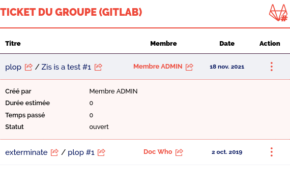
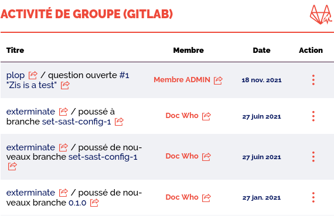

# Examples

## Issue
```htmldjango



```

would return with the default template something like:

---
```{include} examples/issue_default.html
```
---

This is rather simplistic, but with a bit of template overiding and css, you could easily go to this instead:



## Event

```htmldjango



```

would return with the default template something like:

---
```{include} examples/event_default.html
```
---

This is rather simplistic, but with a bit of template overriding and css, you could easily go to this instead:


